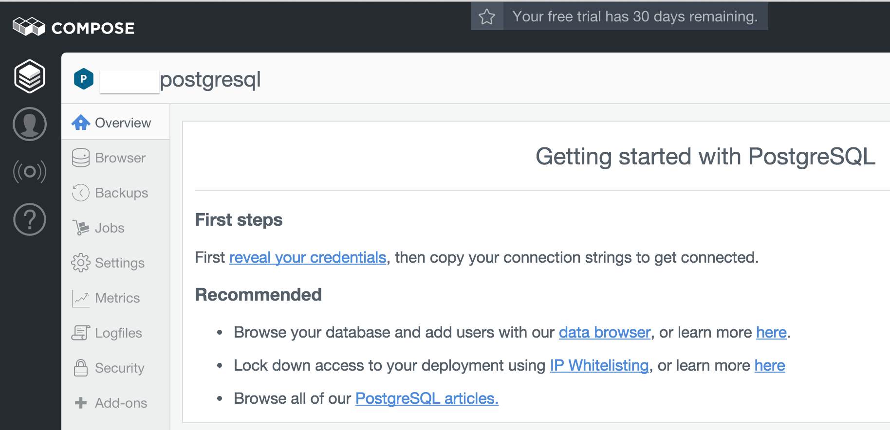
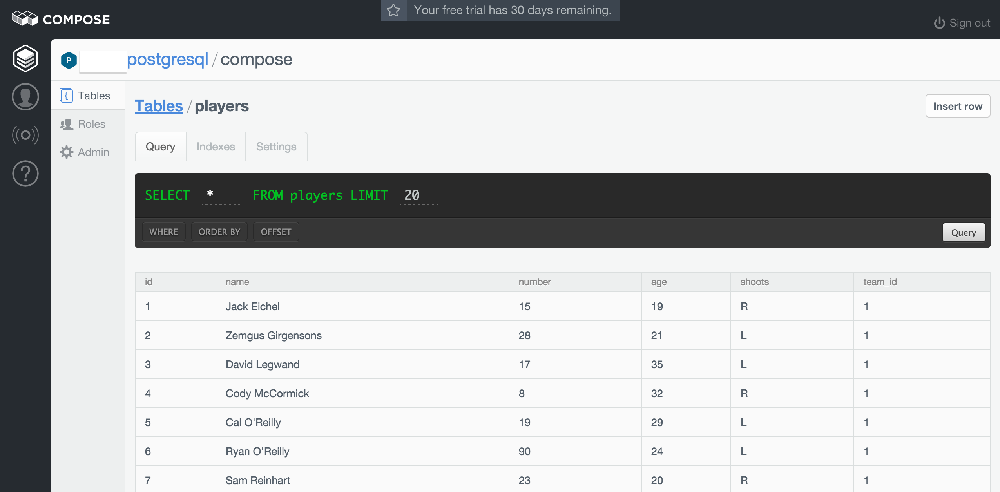

Compose: PostgreSQL and Ruby
============================

Let's investigate the hosted database options of
[Compose](https://compose.io/), your friendly Database as a Service
company.

Compose databases are replicated by default, so say hello to fault
tolerence. They also include automated failover and daily backups.

Our primary goals are:

1. Setup a PostgreSQL database.
2. Connect using Ruby (securely, if possible).
3. Import a small dataset.
4. Query the dataset.

No problem, right? I'm choosing Ruby and Postgres because they are
mainstream technologies that serve as sensible defaults. However,
Compose supports many databases and languages.

Setup a PostgreSQL database
---------------------------
First, make sure you're signed up for
[Compose PostgreSQL](https://compose.io/postgresql/).

When you login a dashboard appears that provides information about
your database. This includes the connection settings you'll need in
the next step.



Connect Using Ruby
------------------

A quick search for tools that help connect Ruby to Postgres leads to
the [pg](http://deveiate.org/code/pg/README_rdoc.html) gem.

***

I installed `pg` via [Bundler](http://bundler.io/). It is also listed
as a dependency in this project's [Gemfile](./Gemfile), so you can run
`bundle install` in this directory to obtain it.

Most sites assume you're using
[Active Record](http://edgeguides.rubyonrails.org/active_record_basics.html)
(as part of Rails), so the docs for using `pg` directly are
slim. While Rails and ActiveRecord are helpful abstractions, I felt
they were overkill for this exercise.

***

Once `pg` is installed, possibly via `bundle install`, Ruby can
connect to your database with:

```ruby
conn = PG::Connection.new({:user => ENV["COMPOSE_USERNAME"],
                           :password => ENV["COMPOSE_PASSWORD"],
                           :dbname => "compose",
                           :host => "aws-us-east-1-portal.9.dblayer.com",
                           :port => "10366",
                           :sslmode => "require"})
```

_Note: You'll need to replace these values with your personal settings
from the Compose dashboard. You'll also need to create environment
variables named `COMPOSE_USERNAME` and `COMPOSE_PASSWORD` with the
values from the dashboard._

If you place that snippet into a Ruby file named
[script.rb](./script.rb), then you can run it by typing
`./script.rb` into your terminal.

Import Data
-----------

We'll need to create tables before we can add data.

### 1) Create tables ###

Your database is initially empty. Create a table to store hockey teams
by adding the following to `script.rb`.

```ruby
conn.exec(%q{
    CREATE TABLE teams (
        id INT PRIMARY KEY,
        name VARCHAR(100),
        division VARCHAR(20),
        founding_year INT
    );
})
```

_Note: here `conn` is the `PG::Connection` we created in the
first step and `exec` runs an SQL statement on the database._

Let's also create a table for storing hockey players. We might as well
use a foreign key to reference the teams table since we're using a
relational database.

```ruby
conn.exec(%q{
    CREATE TABLE players (
        id SERIAL PRIMARY KEY,
        name VARCHAR(100),
        number INT,
        age INT,
        shoots CHAR(1),
        team_id INTEGER REFERENCES teams
    );
})
```

### 2) Insert data ###

To get some data into these tables, we'll insert teams and
players.

```ruby
conn.exec_params(%q{
    INSERT INTO teams (id, name, division, founding_year) VALUES
        ($1, 'Buffalo Sabres', 'Atlantic', 1970),
        ($2, 'Toronto Maple Leafs', 'Atlantic', 1917);
}, [SABRES_ID, LEAFS_ID])

conn.exec_params(%q{
    INSERT INTO players (name, number, age, shoots, team_id) VALUES
        ('Jack Eichel',       15, 19, 'R', $1),
        ('Zemgus Girgensons', 28, 21, 'L', $1),
        ('David Legwand',     17, 35, 'L', $1),
        ('Cody McCormick',     8, 32, 'R', $1),
        ('Cal O''Reilly',     19, 29, 'L', $1),
        ('Ryan O''Reilly',    90, 24, 'L', $1),
        ('Sam Reinhart',      23, 20, 'R', $1),
        ('Tyler Bozak',       42, 29, 'R', $2),
        ('Byron Froese',      56, 24, 'R', $2),
        ('Peter Holland',     24, 24, 'L', $2),
        ('Nazem Kadri',       43, 25, 'L', $2),
        ('Leo Komarov',       47, 28, 'L', $2),
        ('Shawn Matthias',    23, 27, 'L', $2),
        ('Nick Spaling',      16, 27, 'L', $2)
}, [SABRES_ID, LEAFS_ID])
```
_Note: here `exec_params` is similar to `exec`, but the
values in the second parameter are substituted for `$1` and `$2`._

Once we've done this, as a verification step, we can see our data
in
[Compose's Data Browser](https://www.compose.io/articles/introducing-the-new-compose-data-browser/)
utility.



Query the data
--------------

I'm constantly shocked by how young these professional athletes are!
Let's do some hard-hitting statistical analysis by way of example.

### Select all of the teams ###

First, a simple example to retrieve all of the teams in our database:

```ruby
conn.exec("SELECT * FROM teams;") do |result|
  result.each do |row|
    puts "The #{row['name']} were founded in #{row['founding_year']}."
  end
end

# Outputs:
# The Buffalo Sabres were founded in 1970.
# The Toronto Maple Leafs were founded in 1917.
```

_Note: each `row` is a `Hash` with the table columns as keys._

### Select the 5 youngest players ###

A more complex query works similarly. This will retrieve the 5
youngest players across both teams:

```ruby
conn.exec(%q{
    SELECT p.name AS player, p.age, t.name AS team
    FROM players AS p
    JOIN teams AS t ON t.id = p.team_id
    ORDER BY age ASC
    LIMIT 5;
}) do |result|
  puts "The five youngest players are:"
  result.each do |row|
    puts " #{row['player']} is #{row['age']} and plays for the #{row['team']}."
  end
end

# Outputs:
# The five youngest players are:
#  Jack Eichel is 19 and plays for the Buffalo Sabres.
#  Sam Reinhart is 20 and plays for the Buffalo Sabres.
#  Zemgus Girgensons is 21 and plays for the Buffalo Sabres.
#  Ryan O'Reilly is 24 and plays for the Buffalo Sabres.
#  Byron Froese is 24 and plays for the Toronto Maple Leafs.
```

### Select the oldest player on each team ###

Here is one way to find the oldest player on each team:

```ruby
oldest = "SELECT name,age FROM players WHERE team_id=$1 ORDER BY age DESC LIMIT 1;"
get_oldest = Proc.new { |rows| rows.values.flatten }
sabres_oldest = conn.exec_params(oldest, [SABRES_ID], &get_oldest)
leafs_oldest = conn.exec_params(oldest, [LEAFS_ID], &get_oldest)

puts "The oldest player on the Sabres is #{sabres_oldest[0]}. He is #{sabres_oldest[1]}."
puts "The oldest player on the Leafs is #{leafs_oldest[0]}. He is #{leafs_oldest[1]}."

# Outputs:
# The oldest player on the Sabres is David Legwand. He is 35.
# The oldest player on the Leafs is Tyler Bozak. He is 29.
```

_Note: the previous queries each used a Ruby `block` to handle the
results. This last example will use a `proc` instead to aid with code
reuse._

### Closing the DB connection

Finally, it's good to close your connection to the database when you
are done.

```ruby
conn.close()
```

Wrapping up
-----------

So there you have it. An example of signing up for Compose and
connecting to a Postgres database using a Ruby script. If you don't
like writing SQL,
[ActiveRecord](http://guides.rubyonrails.org/active_record_basics.html)
is an ORM that simplifies queries, manages migrations, and has
commands for seeding test data. But that is a topic for another post.

***

All the code in this document can be found in the
[script.rb](./script.rb) file. You can run it from the command line
by entering `./script.rb`. (Remember, you'll need to have the `pg` gem
installed.)

***
